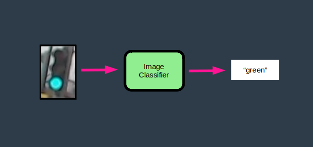
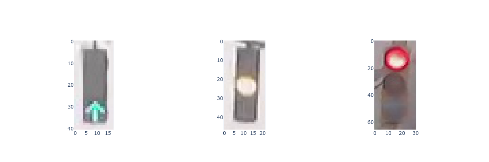
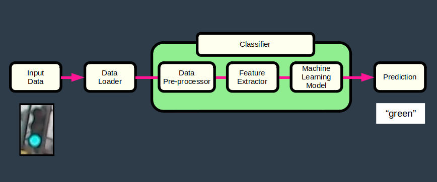
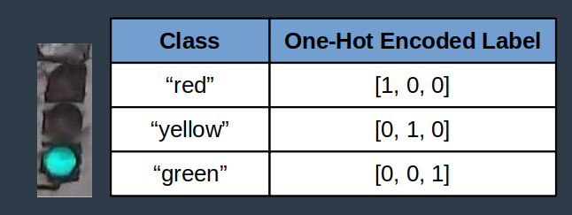
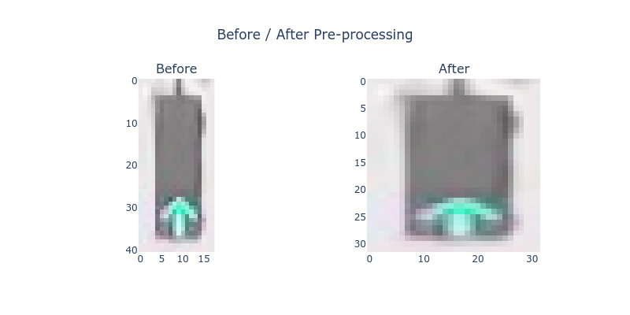
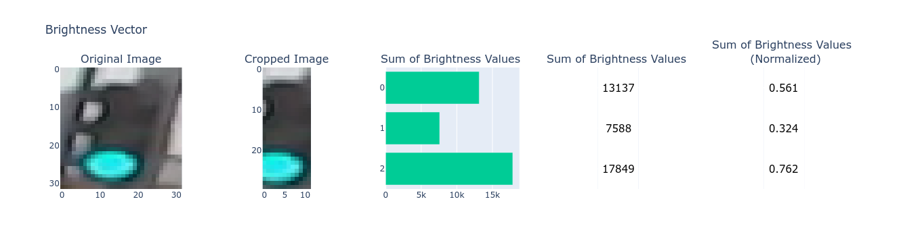
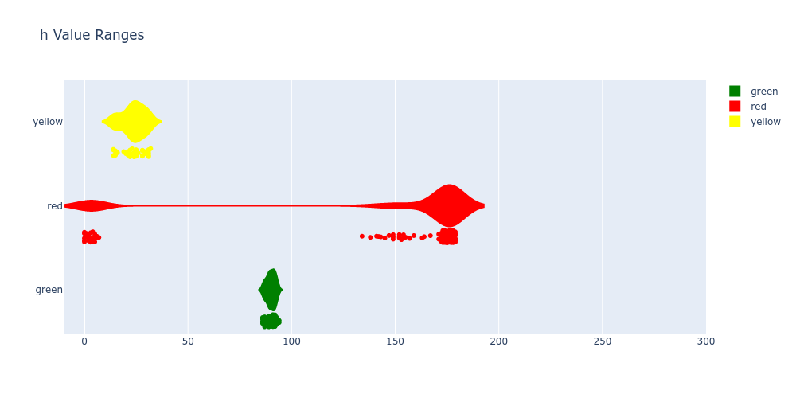
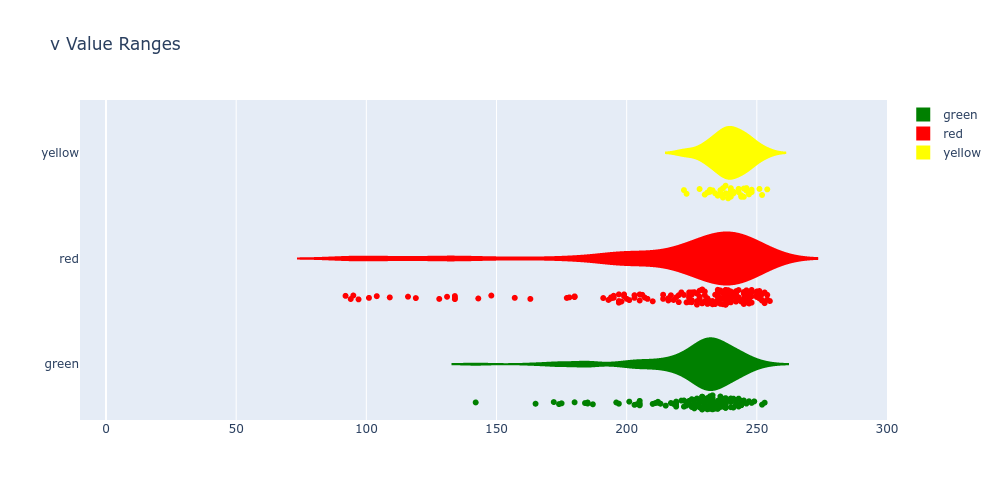
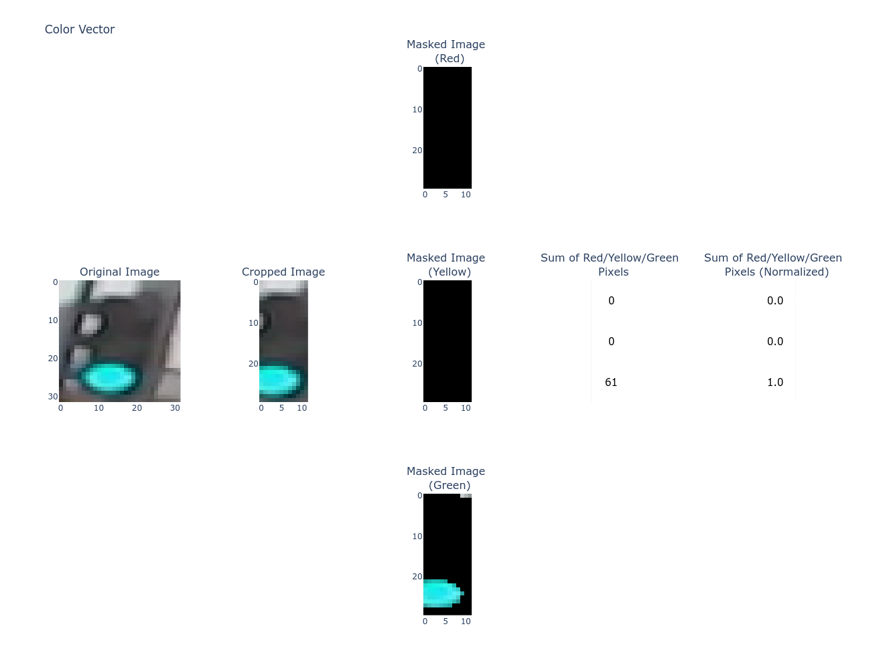

# Intro to Self-Driving Cars Nanodegree - Project 5
# Traffic Light Classifier

This project develops a traffic light classifier for a self-driving car.

This is the 5th project in Udacity's Introduction to Self-Driving Cars Nanodegree [1]. This README serves as a final report for the project.

Please note that in this project students had to engineer their own features, build their own dataloaders and code their ML model. Librairies and tools such as scikit-learn, PyTorch or Keras could not be used.

 


# Table of Content

INSTALL

- [Install](#install)
- [Project Files](#project-files)

PROBLEM DEFINITION

- [Problem](#problem)
- [Requirements](#requirements)

DATA

- [Input Data](#input-data)
- [Data Exploration](#data-exploration)
- [Datasets](#datasets)

DESIGN

- [Pipeline](#pipeline)
- [Data Loader](#data-loader)
- [Data Pre-Processor](#data-pre-processor)
- [Feature Extractor](#feature-extractor)
- [Machine Learning Model](#machine-learning-model)
    - [Model Selection](#model-selection)
    - [Hyperparameter Search](#hyperparameter-search)
	- [Testing](#testing)
	
CONCLUSION

- [Deployment](#deployment)
- [Possible Improvements](#possible-improvements)
- [References](#references)

# Install

1 - Clone this repository.

	$ cd ~
	$ git clone https://github.com/martin0004/traffic_light_classifier.git

2 - Install miniconda.

	$ https://docs.conda.io/en/latest/miniconda.html

3 - Create conda environment for this project.

The command below creates the "tlc" conda environment, which stands for "Traffic Light Classifier".

	$ cd ~/traffic_light_classifier/install
	$ conda env create --file environment.yaml   # Creates tlc environment

4 - Activate environment.

	$ conda activate tlc

5 - Run the classifier on a dummy image.

	(tlc) $ cd ~/traffic_light_classifer/src
	(tlc) $ python3 classify.py testme.jpg
	green

6 - [OPTIONAL] Open the Jupyter Notebooks which were used for designing & training the classifier.

	(tlc) $ cd ~/traffic_light/classifier
	(tlc) $ jupyter lab
	
	then navigate to /dev/design.ipynb
	             and /dev/training.ipynb

# Project Files

The most important files & directories in this project are listed below.

```
dev/
    design.ipynb                 Notebook for designing the classifier & evaluator.
    training.ipynb               Notebook for training the classifier.
    pixels.csv                   Pixel coordinates for extracting h-s-v ranges.

images/
    report/                      Images used in the README.
    traffic_light_images/
        test/                    Testing dataset.
        training/                Training dataset.

install/
    environment.yaml             Conda environment file.

src/
    classify.py                  Code for the data loader, classifier & evaluator.
    testme.jpg                   Dummy image for testing the classifier. 
```


# Problem

A traffic light image classifier had to be developed for a self-driving car. This classifier is able to predict whether the traffic light is "red", "yellow" or "green" on simple traffic light images.

 

# Requirements

The classifier had to meet the following criteria.

- Accuracy > 90 %.
- Never classify a red light as green.


# Input Data

The dataset used in this project is made of images from the MIT's Self-Driving Car Course [4][5]. The dataset contains 1484 traffic light images which are available in directory`images/traffic_light_images` .



# Data Exploration

The following observations were made during the data exploration phase.

- All images are pictures of 3-light traffic lights with one light illuminated.
- The light order is always the same: red light at the top, yellow in the middle, green at the bottom.
- Some traffic lights are shaped as circles, others as arrows.
- Image files are relatively small (< 10 kB).
- Images have different sizes, which can range from approximately 17x37 (smallest) to 111x214 (largest).

# Datasets

The traffic light images were provided to students already split in a training and testing datasets. Here are some stats regarding this split.

| Dataset  | % Total | Total   | Green | Yellow | Red |
|----------|---------|---------|-------|--------| ----|
| Training | 80 %    |    1187 |   429 |     35 | 723 |
| Testing  | 20 %    |     297 |   107 |      9 | 181 | 
| Total    |         |    1484 |       |        |     |


# Pipeline

The classifier pipeline is made of the following components. These components are similar to the pipeline from reference [2].

 


# Data Loader

The data loader loads images in a format the classifier can manipulate. 2 loading methods can be used.

- Method 1: load a training or testing dataset (used during training). In that case, provide a list of classes and the directory path where images are stored.

		classes = ["red", "yellow", "green"]
		df_images, df_true_labels = DataLoader(classes).load_dataset(PATH_TO_DIR)

	The directory must itself contain 3 subdirectories, each having the exact same name as the classes. Labels are created based on the directory names.

		path/to/training/            path/to/test/
		    green/                       green/
	 	    red/                         red/
		    yellow/                      yellow/
	
	Note that labels are one-hot encoded when loaded into memory.
	  	  
	
	  	 

- Method 2: load a single image (used to make a prediction on an unlabelled image).

		df_image = DataLoader().load_image(PATH_TO_IMG)


# Data Pre-Processor

The data pre-processor simply resizes all images to a square shape of 32 x 32 pixels.



# Feature Extractor

The feature extractor identifies features in each image. These features are then reused by the machine learning model.

### Feature 1: Brightness Vector

This feature is a 3-item vector which represents the brightness distribution over an image. Brightness was defined as the sum of v values (in HSV colorspace) over each 1/3 of an image.




### Feature 2: Color Vector

This feature is a 3-item vector containing the number of "red", "yellow" and "green" pixels in an image. Range of hue (h) and brightness (v) values were obtained by selecting pixels on some red, yellow and green lights in the training dataset, then used to create color masks.





# Machine Learning Model

### Model Selection

The model used in this project is a simple equation combining features to the predict the label of an image.

 ŷ = max_score(w<sub>1</sub> * x<sub>1</sub> + w<sub>2</sub> *  x<sub>2</sub>)

where:

| Symbol                       | Description                                                   |
|------------------------------|---------------------------------------------------------------|
| ŷ                            | Predicted label (of a single image).                          |
| w<sub>1</sub>, w<sub>2</sub> | Feature weights.                                              |
| x<sub>1</sub>                | Feature 1 - Normalized brightness vector (of a single image). |
| x<sub>2</sub>                | Feature 2 - Normalized color vector (of a single image).      |
| max_score(x)                 | Function which turns the highest value of a vector to 1 <br> and other values to 0. |


### Hyperparameter Search

An hyperparameter search was performed. Results are listed in the table below.

Parameters of run #9 met the project requirements.


| Hyperparameters              | Description  |
|------------------------------|--------------|
| img_size                     | Image size when resizing <br> (used by data pre-processor). |
| crop_left                    | Number of pixels removed on the left & right side of image <br> (used by feature extractor). |
| crop_top                     | Number of pixels removed on the top & bottom of image <br> (used by feature extractor). |
| w<sub>1</sub>, w<sub>2</sub> | Feature weights <br> (used by machine learning model). |


| run|   img_size |   crop_left |   crop_top |   w1 |   w2 |   accuracy | reds<br>predicted<br>green | Note      |
|---:|-----------:|------------:|-----------:|-----:|-----:|-----------:|---------------------------:|-----------|
|  0 |         32 |          10 |          1 |    1 |    1 |      0.864 |                          0 | benchmark |
|  1 |         32 |          10 |          1 |    1 |    0 |      0.955 |                          1 |           |
|  2 |         32 |          10 |          1 |    0 |    1 |      0.848 |                          0 |           |
|  3 |         32 |          10 |          1 |    1 |    1 |      0.864 |                          0 |           |
|  4 |         32 |          10 |          1 |    2 |    1 |      0.877 |                          0 |           |
|  5 |         32 |          10 |          1 |    1 |    2 |      0.858 |                          0 |           |
|  6 |         32 |          12 |          2 |    1 |    0 |      0.984 |                          5 |           |
|  7 |         32 |          12 |          2 |    0 |    1 |      0.865 |                          0 |           |
|  8 |         32 |          12 |          2 |    1 |    1 |      0.884 |                          0 |           |
|  9 |         32 |          12 |          2 |    2 |    1 |      0.907 |                          0 |           |
| 10 |         32 |          12 |          2 |    1 |    2 |      0.88  |                          0 |           |


### Testing

The model trained with parameters of run #9 was used to make predictions on the test dataset. project requirements were still met.


# Deployment

Following successful testing, the classifier can now be run on simple images similar to the ones in the training/testing datasets.

	(tlc) $ cd ~/traffic_light_classifer/src
	(tlc) $ python3 classify.py testme.jpg
	green

# Possible Improvements

- Improve the argument parsing of `classify.py`.

- Try to classify the same dataset using a very simple neural network.

# References

[1] Udacity's Introduction to Self-Driving Cars Nanodegree. https://www.udacity.com/course/intro-to-self-driving-cars--nd113 <br>
[2] Udacity's Introduction to Self-Driving Cars Nanodegree, Part 8 - Computer Vision and Machine Learning, Lesson 1 - Computer Vision and Classification, Section 7 - Image Classification Pipeline. <br>
[3] Serrano, Luis, Grokking Machine Learning, Manning Editions. <br>
[4] MIT self-driving car course, https://selfdrivingcars.mit.edu/ <br>
[5] Udacity, Instructions for this project, https://github.com/udacity/iSDC-P5-traffic-light-classifier-starter-code/blob/master/Traffic_Light_Classifier.ipynb