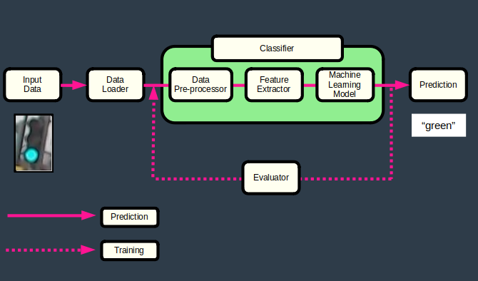
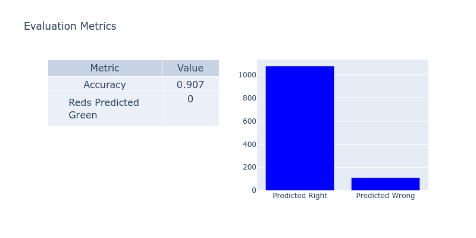

# Intro to Self-Driving Cars Nanodegree - Project 5
# Traffic Light Classifier

This project develops a traffic light classifier for a self-driving car.

This is the 5th project in Udacity's Introduction to Self-Driving Cars Nanodegree [1].

 

Notes

- My original report for this project was a Jupyter notebook which was delivered to Udacity in January 2021. This repository is an improved version of this initial project.
- In this project, students had to engineer their own features, build their own dataloaders and ML models. Therefore, tasks had to be completed without using tools like scikit-learn, PyTorch or Keras.

# Table of Content

- [Install](#install)
- [Project Files](#project-files)
- [Process](#process)
- [Input Data](#input-data)
- [Problem Definition](#problem-definition)
- [Design](#design)
	- [Data Loader](#data-loader)
	- [Data Pre-Processor](#data-pre-processor)
	- [Feature Extractor](#feature-extractor)
	- [Machine Learning Model](#machine-learning-model)
- [Train](#train)
- [Test](#test)
- [Deployment](#deployment)
- [Possible Improvements](#possible-improvements)
- [References](#references)

# Install

1 - Clone this repository.

	$ cd ~
	$ git clone https://github.com/martin0004/traffic_light_classifier.git

2 - Install miniconda.

	$ https://docs.conda.io/en/latest/miniconda.html

3 - Create conda environment for this project.

The command below creates the "tlc" conda environment, which stands for "Traffic Light Classifier".

	$ cd ~/traffic_light_classifier/install
	$ conda env create --file environment.yaml   # Creates tlc environment

4 - Activate environment.

	$ conda activate tlc

5 - Run the classifier on a dummy image.

	(tlc) $ cd ~/traffic_light_classifer/src
	(tlc) $ python3 classify.py testme.jpg
	green

6 - [OPTIONAL] Open the Jupyter Notebooks which were used for designing & training the classifier.

	(tlc) $ cd ~/traffic_light/classifier
	(tlc) $ jupyter lab
	
	then navigate to /dev/design.ipynb
	             and /dev/training.ipynb

# Project Files

The most important files & directories in this project are listed below.

```
dev/
    design.ipynb                 Notebook for designing the classifier & evaluator.
    training.ipynb               Notebook for training the classifier.
    pixels.csv                   Pixel coordinates for extracting h-s-v ranges.

images/
    report/                      Images used in the README.
    traffic_light_images/
        test/                    Testing dataset.
        training/                Training dataset.

install/
    environment.yaml             Conda environment file.

src/
    classify.py                  Code for the data loader, classifier & evaluator.
    testme.jpg                   Dummy image for testing the classifier. 
```

# Process

The image below shows the overall process used to develop the classifier.

 

# Problem Definition

### Problem

A traffic light image classifier had to be developed for a self-driving car. This classifier is able to predict whether the traffic light is "red", "yellow" or "green" on simple traffic light images.

 

### Requirements

The classifier had to meet the following criteria.

- Accuracy > 90 %.
- Never classify a red light as green.


# Input Data

### Raw Data

1484 images are available in directory `images/traffic_light_images` and were used for developing the classifier. Here are some sample images from this directory.


Images have the following properties.

- All images are pictures of 3-light traffic lights with one light illuminated.
- The light order is always the same: red light at the top, yellow in the middle, green at the bottom.
- Some traffic lights are shaped as circles, others as arrows.
- Image files are relatively small (< 10 kB).
- Images have different sizes, which can range from approximately 17x37 (smallest) to 111x214 (largest).

### Datasets

Images are divided into the following datasets.

| Dataset  | % Total | Total   | Green | Yellow | Red |
|----------|---------|---------|-------|--------| ----|
| Training | 80 %    |    1187 |   429 |     35 | 723 |
| Testing  | 20 %    |     297 |   107 |      9 | 181 | 
| Total    |         |    1484 |       |        |     |


# Design

The classifier is made of the following components. These components are similar to the pipeline from reference [2].

 


### Data Loader

The data loader loads images in a format the classifier can manipulate. 2 loading methods can be used.

- Method 1: load a training or testing dataset (used during training). In that case, provide a list of classes and the directory path where images are stored.

		classes = ["red", "yellow", "green"]
		df_images, df_true_labels = DataLoader(classes).load_dataset(PATH_TO_DIR)

	The directory must itself contain 3 subdirectories, each having the exact same name as the classes. Labels are created based on the directory names.

		path/to/training/            path/to/test/
		    green/                       green/
	 	    red/                         red/
		    yellow/                      yellow/
	
	Note that labels are one-hot encoded when loaded into memory.
	  	  
	
	  	 

- Method 2: load a single image (used to make a prediction on an unlabelled image).

		df_image = DataLoader().load_image(PATH_TO_IMG)


### Data Pre-Processor

The data pre-processor simply resizes all images to a square shape of 32 x 32 pixels.


### Feature Extractor

The feature extractor identifies features in each image. These features are then reused by the machine learning model.

##### Feature 1: Brightness Vector

This feature is a 3-item vector which represents the brightness distribution over an image. Brightness was defined as the sum of v values (in HSV colorspace) over each 1/3 of an image.


##### Feature 2: Color Vector

This feature is a 3-item vector containing the number of "red", "yellow" and "green" pixels in an image. Range of hue (h) and brightness (v) values were obtained by selecting pixels on some red, yellow and green lights in the training dataset, then used to create color masks.


### Machine Learning Model

Features were combined in a simple machine learning model in order to predict the label of an image.

 ŷ = max_score(w<sub>1</sub> * x<sub>1</sub> + w<sub>2</sub> *  x<sub>2</sub>)

where:

| Symbol                       | Description                                                   |
|------------------------------|---------------------------------------------------------------|
| ŷ                            | Predicted label (of a single image).                          |
| w<sub>1</sub>, w<sub>2</sub> | Feature weights.                                              |
| x<sub>1</sub>                | Feature 1 - Normalized brightness vector (of a single image). |
| x<sub>2</sub>                | Feature 2 - Normalized color vector (of a single image).      |
| max_score(x)                 | Function which turns the highest value of a vector to 1 <br> and other values to 0. |


# Train

The classifier parameters were adjusted during a training phase. Predictions were made using the classifier for several parameter combinations.

Parameters of run #9 met the project requirements. Evaluation metrics for this run are shown in a chart below.


| Training Parameters          | Description  |
|------------------------------|--------------|
| img_size                     | Image size when resizing <br> (used by data pre-processor). |
| crop_left                    | Number of pixels removed on the left & right side of image <br> (used by feature extractor). |
| crop_top                     | Number of pixels removed on the top & bottom of image <br> (used by feature extractor). |
| w<sub>1</sub>, w<sub>2</sub> | Feature weights <br> (used by machine learning model). |


| run|   img_size |   crop_left |   crop_top |   w1 |   w2 |   accuracy | reds<br>predicted<br>green | Note      |
|---:|-----------:|------------:|-----------:|-----:|-----:|-----------:|---------------------------:|-----------|
|  0 |         32 |          10 |          1 |    1 |    1 |      0.864 |                          0 | benchmark |
|  1 |         32 |          10 |          1 |    1 |    0 |      0.955 |                          1 |           |
|  2 |         32 |          10 |          1 |    0 |    1 |      0.848 |                          0 |           |
|  3 |         32 |          10 |          1 |    1 |    1 |      0.864 |                          0 |           |
|  4 |         32 |          10 |          1 |    2 |    1 |      0.877 |                          0 |           |
|  5 |         32 |          10 |          1 |    1 |    2 |      0.858 |                          0 |           |
|  6 |         32 |          12 |          2 |    1 |    0 |      0.984 |                          5 |           |
|  7 |         32 |          12 |          2 |    0 |    1 |      0.865 |                          0 |           |
|  8 |         32 |          12 |          2 |    1 |    1 |      0.884 |                          0 |           |
|  9 |         32 |          12 |          2 |    2 |    1 |      0.907 |                          0 |           |
| 10 |         32 |          12 |          2 |    1 |    2 |      0.88  |                          0 |           |




# Test

The trained classifier was then ran on the testing dataset and requirements were still met.


# Deployment

Following successful testing, the classifier can now be run on simple images similar to the ones in the training/testing datasets.

	(tlc) $ cd ~/traffic_light_classifer/src
	(tlc) $ python3 classify.py testme.jpg
	green

# Possible Improvements

- Improve the argument parsing of `classify.py`.

- Try to classify the same dataset using a very simple neural network.

# References

[1] Udacity's Introduction to Self-Driving Cars Nanodegree. https://www.udacity.com/course/intro-to-self-driving-cars--nd113 <br>
[2] Udacity's Introduction to Self-Driving Cars Nanodegree, Part 8 - Computer Vision and Machine Learning, Lesson 1 - Computer Vision and Classification, Section 7 - Image Classification Pipeline. <br>
[3] Serrano, Luis, Grokking Machine Learning, Manning Editions.
