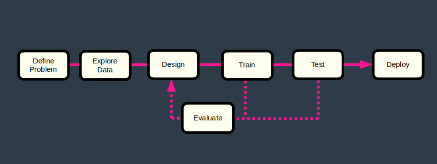

# Intro to Self-Driving Cars Nanodegree - Project 5
# Traffic Light Classifier

This project develops a traffic light classifier for a self-driving car.

This is the 5th project in Udacity's Introduction to Self-Driving Cars Nanodegree [1].

 

Notes

- My original report for this project was a Jupyter notebook which was delivered to Udacity in January 2021. The Github repository you are reading is an improved version of this initial project.
- This project had to be completed without using tools like scikit-learn and PyTorch. So no neural networks in here...

# Table of Content

- [Install](#install)
- [Project Files](#project-files)
- [Problem Definition](#problem-definition)
- [Process](#process)
- [Input Data](#input-data)
- [Data Pre-processor](#data-pre-processor)
- [Feature Extractor](#feature-extractor)
- [Machine Learning Model](#machine-learning-model)
- [Evaluator](#evaluator)
- [Training](#training)
- [Testing](#testing)
- [Possible Improvements](#possible-improvements)
- [References](#references)

# Install

1 - Clone this repository.

	$ cd ~
	$ git clone https://github.com/martin0004/traffic_light_classifier.git

2 - Install miniconda.

	$ https://docs.conda.io/en/latest/miniconda.html

3 - Create conda environment for this project.

The command below creates the "isdcnd" conda environment, which stands for "Intro to Self-Driving Cars Nanodegree".

	$ cd ~/traffic_light_classifier/install
	$ conda env create --file environment.yaml   # Creates isdcnd environement

4 - Activate environment.

	$ conda activate isdcnd

5 - Run the classifier on a dummy image.

	(isdcnd) $ cd ~/traffic_light_classifer/src
	(isdcnd) $ python3 classify.py testme.jpg
	green

6 - [OPTIONAL] Open the Jupyter Notebooks which were used for designing & training the classifier.

	(isdcnd) $ cd ~/traffic_light/classifier
	(isdcnd) $ jupyter lab
	
	then navigate to /dev/design.ipynb
	             and /dev/training.ipynb

# Project Files

The most important files & directories in this project are listed below.

```
dev/
    design.ipynb                 Notebook for designing the classifier & evaluator.
    training.ipynb               Notebook for training the classifier.
    pixels.csv                   Pixel coordinates for extracting h-s-v ranges.

images/
    report/                      Images used in the README.
    traffic_light_images/
        test/                    Testing dataset.
        training/                Training dataset.

install/
    environment.yaml             Conda environment file.

src/
    classify.py                  Code for the data loader, classifier & evaluator.
    testme.jpg                   Dummy image for testing the classifier. 
```

# Problem Definition

### Problem

A traffic light image classifier had to be developed for a self-driving car. This classifier is able to predict whether the traffic light is "red", "yellow" or "green" on simple traffic light images.

 

### Requirements

The classifier had to meet the following criteria.

- Accuracy > 90 %.
- Never classify a red light as green.


# Process

The process followed in this project was based on reference [2].

### Design Phase

- The **classifier** was coded by developing 3 components.

	- A **data pre-processor**, which standardizes every input image.
	- A **feature extractor**, which identifies features in every image.
	- A **machine learning model**, which combines an image features to make a prediction.

- Besides the classifier, a **data loader** was also coded. This loader takes an image file and loads it into computer memory in a form the classifier can understand.


### Training Phase

- After the initial design phase, the classifier went tru several training loops. These training loops were run on an training dataset. Images in this dataset had already been labeled with their respective color.

- An **evaluator** checked the classifier performance after each loop. The classifier design or internal parameters were updated each time project requirements were not met.

### Testing Phase

- If requirements were met in the training phase, a single run was performed on the testing dataset, reusing the parameters selected during training. If requirements were not met, the process went back to the training phase.

### Prediction Phase

- If the testing run was successful, the classifier could then be used to predict colors of traffic light images for which labels were unknown.

 


# Input Data

### Raw Data

1484 images are available in directory `images/traffic_light_images` and were used for developing the classifier. Here are some sample images from this directory.


Images have the following properties.

- All images are pictures of 3-light traffic lights with one light illuminated.
- The light order is always the same: red light at the top, yellow in the middle, green at the bottom.
- Some traffic lights are shaped as circles, others as arrows.
- Image files are relatively small (< 10 kB).
- Images have different sizes, which can range from approximately 17x37 (smallest) to 111x214 (largest).

### Datasets

Images are divided into the following datasets.

| Dataset  | % Total | Total   | Green | Yellow | Red |
|----------|---------|---------|-------|--------| ----|
| Training | 80 %    |    1187 |   429 |     35 | 723 |
| Testing  | 20 %    |     297 |   107 |      9 | 181 | 
| Total    |         |    1484 |       |        |     |

# Data Loader

The data loader loads images in a format the classifier can manipulate. 2 loading methods can be used.

- Method 1: load a training or testing dataset (used during training). In that case, provide a list of classes and the directory path where images are stored.

		classes = ["red", "yellow", "green"]
		df_images, df_true_labels = DataLoader(classes).load_dataset(PATH_TO_DIR)

	The directory must itself contain 3 subdirectories, each having the exact same name as the classes. Labels are created based on the directory names.

		path/to/training/            path/to/test/
		    green/                       green/
	 	    red/                         red/
	  	    yellow/                      yellow/
	
	Note that labels are one-hot encoded when loaded into memory.
	  	  
	
	  	 

- Method 2: load a single image (used to make a prediction on an unlabelled image).

		df_image = DataLoader().load_image(PATH_TO_IMG)


# Data Pre-Processor

The data pre-processor simply resizes all images to a square shape of 32 x 32 pixels.


# Feature Extractor

Two features were extracted from each image and reused by the machine learning model.

### Feature 1: Brightness Vector

This feature is a 3-item vector which represents the brightness of each 1/3 of an image (top part / center part / bottom part).

Image sides were cropped, keeping only a center band. This eliminated most of the sky, keeping only the light and its frame. The remaining image was converted to HSV colorspace. Brightness values (v) were summed for each 1/3 of the image. The vector was then normalized.


### Feature 2: Color Vector

This feature is a 3-item vector containing the number of "red", "yellow" and "green" pixels in an image.

Range of hue (h) and brightness (v) values were obtained by selecting pixels on some red, yellow and green lights in the training dataset. These values were plotted in violin charts. Ranges were then selected for building color masks. No mask was built for saturation values (s).

Images were cropped with the same bands as the brightness vector. Cropped images were converted to HSV colorspace and masked, keeping only pixels pixels maching the red-yellow-green h-v values found above. Remaining pixels were counted, stored in a vector which was then normalized.


# Machine Learning Model

Features were combined in a simple machine learning model in order to predict the label of an image.

 ŷ = max_score(w<sub>1</sub> * x<sub>1</sub> + w<sub>2</sub> *  x<sub>2</sub>)

where:

| Symbol                       | Description                                                   |
|------------------------------|---------------------------------------------------------------|
| ŷ                            | Predicted label (of a single image).                          |
| w<sub>1</sub>, w<sub>2</sub> | Feature weights.                                              |
| x<sub>1</sub>                | Feature 1 - Normalized brightness vector (of a single image). |
| x<sub>2</sub>                | Feature 2 - Normalized color vector (of a single image).      |
| max_score(x)                 | Function which turns the highest value of a vector to 1 <br> and other values to 0. |


# Evaluator

An evaluator was coded to calculate the classifier accuracy following a training run. Metrics derived by this evaluator are available in sections "Training" and "Testing".

# Training Phase

The classifier parameters were adjusted during a model training phase. Predictions were made using the classifier for several parameter combinations.

Parameters of run #9 met the project requirements. Evaluation metrics for this run are shown in a chart below.


| Training Parameters          | Description  |
|------------------------------|--------------|
| img_size                     | Image size when resizing <br> (used by data pre-processor). |
| crop_left                    | Number of pixels removed on the left & right side of image <br> (used by feature extractor). |
| crop_top                     | Number of pixels removed on the top & bottom of image <br> (used by feature extractor). |
| w<sub>1</sub>, w<sub>2</sub> | Feature weights <br> (used by machine learning model). |


| run|   img_size |   crop_left |   crop_top |   w1 |   w2 |   accuracy | reds<br>predicted<br>green | Note      |
|---:|-----------:|------------:|-----------:|-----:|-----:|-----------:|---------------------------:|-----------|
|  0 |         32 |          10 |          1 |    1 |    1 |      0.864 |                          0 | benchmark |
|  1 |         32 |          10 |          1 |    1 |    0 |      0.955 |                          1 |           |
|  2 |         32 |          10 |          1 |    0 |    1 |      0.848 |                          0 |           |
|  3 |         32 |          10 |          1 |    1 |    1 |      0.864 |                          0 |           |
|  4 |         32 |          10 |          1 |    2 |    1 |      0.877 |                          0 |           |
|  5 |         32 |          10 |          1 |    1 |    2 |      0.858 |                          0 |           |
|  6 |         32 |          12 |          2 |    1 |    0 |      0.984 |                          5 |           |
|  7 |         32 |          12 |          2 |    0 |    1 |      0.865 |                          0 |           |
|  8 |         32 |          12 |          2 |    1 |    1 |      0.884 |                          0 |           |
|  9 |         32 |          12 |          2 |    2 |    1 |      0.907 |                          0 |           |
| 10 |         32 |          12 |          2 |    1 |    2 |      0.88  |                          0 |           |


# Testing Phase

The trained classifier was then ran on the testing dataset and requirements were still met.


# Prediction Phase

Following the training/testing phases, the classifier can now be run on simple images similar to the ones in the training/testing datasets.

	(isdcnd) $ cd ~/traffic_light_classifer/src
	(isdcnd) $ python3 classify.py testme.jpg
	green

# Possible Improvements

- Improve the argument parsing of `classify.py`.

- Try to classify the same dataset using a very simple neural network.

# References

[1] Udacity's Introduction to Self-Driving Cars Nanodegree. https://www.udacity.com/course/intro-to-self-driving-cars--nd113 <br>
[2] Udacity's Introduction to Self-Driving Cars Nanodegree, Part 8 - Computer Vision and Machine Learning, Lesson 1 - Computer Vision and Classification, Section 7 - Image Classification Pipeline.
[3] Serrano, Luis, Grokking Machine Learning, Manning Editions.
